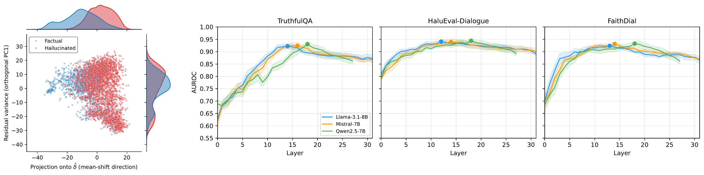

<div align="center">

# LayerMix

### Multi-Layer Probing for Hallucination Detection

[](https://arxiv.org/abs/2608.28930)
[](https://2026.emnlp.org/)
[](LICENSE)
[](https://www.python.org/)
[](https://github.com/js-lee-AI/LayerMix/stargazers)



<b>Official implementation of the <a href="https://2026.emnlp.org/">EMNLP 2026 Main Conference</a> paper.</b>

<em>The signal that separates truthful from hallucinated responses is close to one direction. Removing it drops detection to chance.</em>

<sub>Left: hidden states of one model and dataset, projected onto the centroid-difference direction and onto the leading orthogonal direction. The classes separate along the first and overlap along the second. Right: layer-wise AUROC for three models on three datasets, with the best layer marked. The best layer moves, but a broad band works, which is what LayerMix exploits.</sub>

<b><a href="#overview">Overview</a> · <a href="#install">Install</a> · <a href="#quick-start">Quick start</a> · <a href="#using-it-on-real-activations">Usage</a> · <a href="#citation">Citation</a></b>

</div>

---

## News

- **2026-10** · Presenting at **EMNLP 2026** in Budapest, 24 to 29 October. See you there.
- **2026-08** · Accepted to the **EMNLP 2026 Main Conference**.

## Overview

Official implementation of *The Hallucination Signal Is a Mean Shift*,
published at the EMNLP 2026 Main Conference.

Hidden-state probes detect LLM hallucinations well, and the response to that has
been steadily more elaborate probe architectures. The paper asks what the signal
actually looks like before adding machinery to it, and finds that it is close to
one-dimensional:

* The separation between truthful and hallucinated responses is dominated by a
  single direction, the difference between the two class centroids. Projecting
  that one direction out of the representation drops detection to chance.
* An L2-regularized logistic regression on the raw activations matches or beats
  every architectural alternative we tested. The remaining gap between a
  one-dimensional probe and a full-dimensional one is largely covariance
  estimation under a small sample, not exploitable non-linear structure, which
  is why shrinkage LDA closes most of it.
* The signal occupies a contiguous band of layers rather than a single best one.
  **LayerMix** exploits that: it ranks layers by the effect size of their
  centroid separation on training data, keeps the strongest few, and averages
  their probe scores with weights from the same criterion. That reaches
  oracle-layer accuracy without needing an oracle to pick the layer.

This repository contains the method and the geometry analysis only, without
datasets or baselines.

## What's in this repository

```
layermix/
  geometry.py        centroid direction, effect size, projection, and the
                     full / mean-shift-only / mean-shift-removed decomposition
  probes.py          L2-LR, one-dimensional mean-shift, and shrinkage-LDA probes
  layermix.py        LayerMix: effect-size layer selection and weighted ensemble
  hidden_states.py   optional last-token multi-layer extraction from a model
example.py           runnable demo on synthetic activations (no GPU, no dataset)
```

## Install

```bash
pip install -r requirements.txt
```

`layermix.geometry`, `layermix.probes` and `layermix.layermix` need only numpy
and scikit-learn. `layermix.hidden_states` additionally needs torch and
transformers, and imports them lazily, so the rest of the package works without
them.

## Quick start

```bash
python example.py
```

The demo builds synthetic activations with the geometry the paper reports, a
shift along one direction plus shared noise, and prints:

```
Where the signal lives
  full                             AUROC 0.892
  mean_shift_only                  AUROC 0.895
  mean_shift_removed               AUROC 0.500
```

The third line is the point. Removing one direction out of 256 leaves nothing
behind.

## Using it on real activations

Everything takes a plain `(n_samples, n_features)` array of activations and a
binary label array, so any extraction pipeline works. To use the one included:

```python
from sklearn.model_selection import StratifiedKFold
from layermix import LayerMix, decompose_signal, full_probe
from layermix.hidden_states import extract_layer_states

layers = list(range(model.config.num_hidden_layers))
states = extract_layer_states(model, tokenizer, texts, layers)
splitter = StratifiedKFold(n_splits=5, shuffle=True, random_state=42)

# Where does the signal live at one layer?
parts = decompose_signal(states[14], labels, splitter, full_probe)

# Pick and combine layers without an oracle.
mean_auroc, per_fold = LayerMix(top_k=5).cross_validate(states, labels, splitter)
```

Layer selection, the centroid direction and the probe weights are all estimated
inside the training fold, so held-out samples are never used to choose what they
are scored by.

## Citation

If you use this code, please cite the paper.

```bibtex
@article{lee2026hallucination,
  title   = {The Hallucination Signal Is a Mean Shift: Why Simple Probes Suffice},
  author  = {Lee, Jungseob and Seo, Jaehyung and Lim, Heuiseok},
  journal = {arXiv preprint arXiv:2608.28930},
  year    = {2026},
  url     = {https://arxiv.org/abs/2608.28930}
}
```

## License

MIT. See `LICENSE`.
